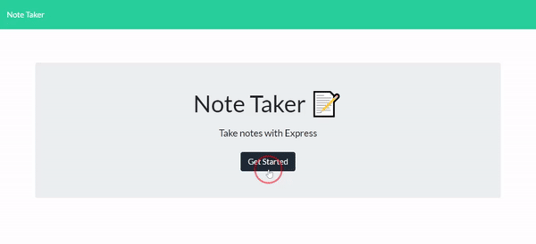

# Online Note-Taker

This is an online note-taking application that uses remote storage for data persistence. It utilizes [Express.js](http://expressjs.com/) to handle get, post, and delete requests from the user to the server.

The user can read previously saved notes by clicking their titles on the side bar, delete saved notes by clicking the red trash icon, or add new notes by clicking the `+` button on the navigation bar, then clicking the save icon after entering a note. 

---

## Getting Started

These instructions will get you a copy of the project up and running on your local machine for development and testing purposes. See deployment for notes on how to deploy the project on a live system.

### Prerequisites

* IDE to view/edit source code (e.g. Visual Studio Code).
* [Node.js](https://nodejs.org/en/)

### Installing

1. Clone repository.
1. Navigate to `note-taker` directory in terminal.
1. `npm install` dependencies for hosting locally.
1. `npm start` to host locally at `http://localhost:3001/`.

### Deployment

* Upload to webhosting service such as GitHub Pages or Heroku.

---

## Deployed Page

* [See Live Site](https://shrouded-meadow-53653.herokuapp.com/)

## Built With

* [Node.js](https://nodejs.org/en/)
* [Express.js](http://expressjs.com/)
* [Heroku](https://www.heroku.com/)

## Author

Vince Lee
- [Portfolio](https://starryblue7.github.io/portfolio-ii/)
- [Github](https://github.com/StarryBlue7)
- [LinkedIn](https://www.linkedin.com/in/vince-lee/)

## License

[MIT License](https://vince-lee.mit-license.org/)

## Acknowledgments

* Base webpage design and scripting provided by [UC Berkeley Coding Bootcamp](https://bootcamp.berkeley.edu/coding/).